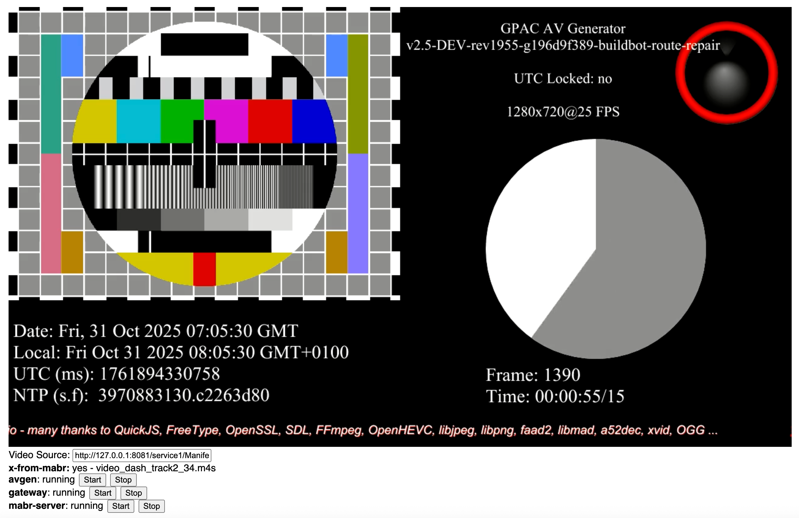

# gpac mabr gateway

## installation

**android/termux**

instructions to build gpac on termux

install the *mediaserver* js scripts:
```
curl /////raw.githubusercontent.com///// /data/data/com.termux/files/home/scd-gateway/
```


**linux**

on linux, assuming you have the latest gpac installed, install the *mediaserver* js scripts:
```
cp gateway/gpac.scripts.jsf.mediaserver/*.js /usr/local/share/gpac/scripts/jsf/mediaserver
```


## configuration

gateway configuration file - `/gateway/termux/gateway.scfg`:
```
[
  {
    "id": "service1",
    "local": "service1/Manifest.mpd",
    "timeshift": 30,
    "http": "https://live-linear.dvb.org/livesim2/tsbd_30/spd_4/utc_httpisoms/start_1735689600/1003_avc_hd_sdr_mpegh/manifest_livesim.mpd",
    "repair": true,
    "js": "dyn_mabr",
    "smartcd_api_endpoint": "http://192.168.1.180:3000/api",
    "smartcd_service_software_release_urn": "urn:1b54fdfa-55da-4896-9f53-028318ad51b5",
    "smartcd_service_computer_guid": "COMP-1"
  }
]
```
For details on the gateway configuration, please refer to gpac's [mediaserver filter documentation](https://wiki.gpac.io/Filters/mediaserver).

Properties starting with `smartcd_api_` are not standard gpac options, but are specific to the `gateway/gpac.scripts.jsf.mediaserver/dyn_mabr.js` module that implements dynamic unicast/multicast switching.

Replace *smartcd_api_endpoint* with to point to the machine exposing the slapos API:
```
    "smartcd_api_endpoint": "http://192.168.1.180:3000/api",
```


## test environment

the scd-gateway-tools command is lightweight nodejs script to setup a test environment

running the scd-gateway-tools command:
```
npm run scd-gateway-tools cfg/local/route.yml
```
- exposes a page to monitor the gateway & play the services with dashjs
- exposes an api to start/stop gpac as an mabr server for the configured services
- exposes a mock of the slapos api to test the gateway in a dynamic unicast/multicast scenario
- starts the gateway as a child process (optional)

the monitor default's default url is [http://127.0.0.1:3000/](http://127.0.0.1:3000/)


**test bench configuration file - `cfg/gateway.yml`**:

port for serving the monitoring page & mock orchestrator APIs:
```
port: 3000
```

the list of service definitions:
```
mcast:
  - service_id: "service1"
    http_origin: "https://live-linear.dvb.org/livesim2/tsbd_30/spd_4/utc_httpisoms/start_1735689600/1003_avc_hd_sdr_mpegh/manifest_livesim.mpd"
    mcast_output: "route://239.255.255.250:1234/:ifce=127.0.0.1"
    slapos_computer_guid: "COMP-1"
```
- each service defines a *unique service id* and a *unique http origin*.
- the value of `slapos_computer_guid` must match on the gateway configuration.


(optional) if a gateway configuration is specified, the tool will automaticaly start the gateway as a child process:
```
gateway:
  port: 8081
  scfg: /scd/gateway/cfg/docker/route.scfg
```


### Docker

*using docker is only supported on linux using the host network mode*

#### gateway tools image

the *scd-gateway-tools* image builds on top of `localhost/gpac:latest` gpac base image:
```
docker build -t localhost/scd-gateway-tools -f gateway/Dockerfile .
```

the `--network host` is required, to allow usage of mabr servers or the mabr gateway:
```
docker run -v ./cfg:/scd/gateway/cfg --network host localhost/scd-gateway-tools:latest
```

#### gpac base image

**amd64 linux host**
```
docker pull gpac/ubuntu:latest
```
on amd64 is the official gpac ubuntu image is used

**arm64 linux host**
```
docker build -t localhost/gpac -f gateway/gpac.arm64.Dockerfile .
```
on arm64 is the official gpac ubuntu image is used

